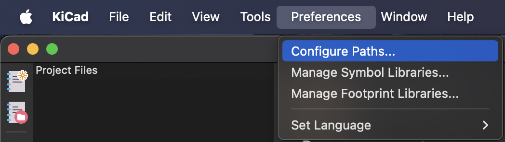
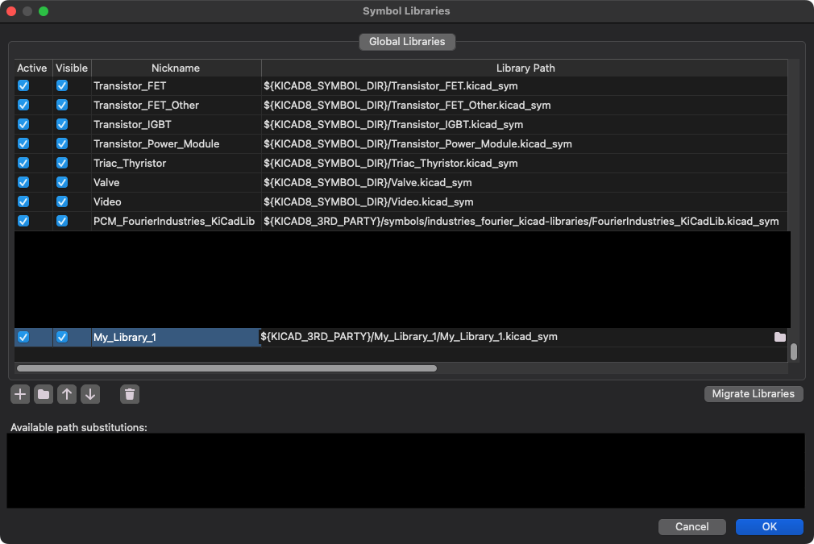

# KiCad Import-LIB-KiCad-Plugin 


> Easy to use KiCad library importer with a professional workflow

<div style="overflow:hidden; margin-top: 20px; margin-bottom: 20px;" align="center">

</div>

This plugin is a fork of the highly popular [Import-LIB-KiCad-Plugin](https://github.com/Steffen-W/Import-LIB-KiCad-Plugin), with an improved UI designed for a more professional KiCad library management workflow.

## Design Philosophy

One of the major reasons why we forked the original plugin was the desire to create a library management framework for a collaborative, decentralised and shared KiCad library across a small to medium-sized organisation with standards based on the 3 Es:

- Easy to Access: accessing the latest version of the library should be a one-click or zero-click process (achieved through Git)
- Easy to Update: adding new parts or modifying parts in the ECAD library should be straightforward and simple (achieved through this plugin)
- Easy to Set up: the setup process should be as straightforward as possible to minimize errors during the setup process (achieved through good procedure)

All of the symbols, footprints and 3D models are placed in one custom-named library (with a single `.kicad_sym` file, a single `.pretty` footprints folder, and a single `.3dshapes` 3D models folder), giving you the flexibility to rapidly import and work with multiple libraries at the same time (for example, you can maintain a single company library and another library for personal use).

## Directories

* `doc/` - assets for documentation
* `plugins/` - source code
* `resource/` - assets included in the plugin

## Installation

Install this plugin using the KiCad Package Content Manager (PCM) with the "Install from File..." option.

## Usage

### Initial Setup

> Initial setup is **very important**!! This plugin will not work if initial setup is not carried out.

**Step 1**: Click on Configure Paths and add a new environment variable called `KICAD_3RD_PARTY`. This should be the folder where all of your third party libraries are placed.



The folder structure inside `KICAD_3RD_PARTY` should look something like this:

```
KICAD_3RD_PARTY folder──┐                                                                                
                        ┼──My_Library_1─┬──My_Library_1.kicad_sym                                        
                        │               │                      ┌──Type_Manufacturer_Footprint_1.kicad_mod
                        │               ├──My_Library_1.pretty─┼                                         
                        │               │                      └──Type_Manufacturer_Footprint_2.kicad_mod
                        │               │                        ┌──Footprint_1.stp                      
                        │               └──My_Library_1.3dshapes─┼                                       
                        │                                        └──Footprint_2.stp                      
                        └──My_Library_2─┬──My_Library_2.kicad_sym                                        
                                        │                      ┌──Type_Manufacturer_Footprint_1.kicad_mod
                                        ├──My_Library_2.pretty─┼                                         
                                        │                      └──Type_Manufacturer_Footprint_2.kicad_mod
                                        │                        ┌──Footprint_1.stp                      
                                        └──My_Library_2.3dshapes─┼                                       
                                                                 └──Footprint_2.stp                                  
```

**Step 2**: Add the symbol library

Next, press the Manage Symbol Library button to bring up the Symbol Libraries window and press + to add the library name you want. The format of the library path must be

```
${KICAD_3RD_PARTY}/My_Library_1/My_Library_1.kicad_sym
```

where `My_Library_1` is the name of your library. 




**Step 3**: Add the footprint library

Finally, press the Manage Footprint Library button to  bring up the Footprint Libraries window and press + to add the library name you want. The format of the library path must be

```
${KICAD_3RD_PARTY}/My_Library_1/My_Library_1.pretty
```

where `My_Library_1` is the name of your library. 


### Adding a Samacsys/SnapEDA/Ultralibrarian/Octopart symbol/footprint ZIP file

Most symbols or footprints come from ZIP files made by these major ECAD component libraries. 

### Adding an LCSC symbol/footprint


### After adding the symbol/footprint

You should do your best to clean up the symbol and footprints after they have been imported into your library. Follow your organisations best practises, but some of the practises that we employ are:


## Caveats

No known caveats yet

## Known issues

No known issues yet

## Contributing

If you encounter any issues with this repository, please do not hesitate to open an issue.
